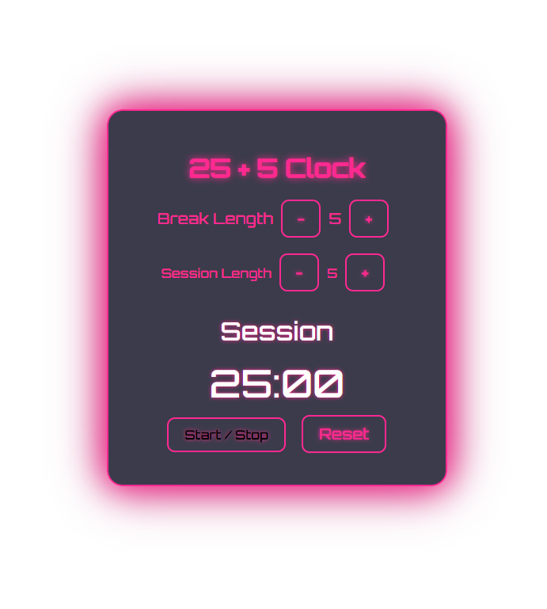

# 🕒 25 + 5 Clock Pomodoro App

A simple and interactive **Pomodoro Timer** built with **React**. Easily switch between work (session) and break intervals, following the classic **25 + 5** productivity method. ⏱️🍅

---

## 🚀 Features

- ⏰ Customizable **Break** and **Session** lengths (1-60 minutes)
- ▶️ Start / Stop functionality
- 🔁 Reset to default (25:00 session / 5:00 break)
- 🔊 Audio alert when switching between session and break
- 🟢 Realtime countdown
- 💻 Built with **React** and **Hooks**

---

## 📸 Preview



---

## 🧠 Technologies Used

- React (with Hooks: `useState`, `useEffect`, `useRef`)
- HTML5 + CSS3
- JavaScript (ES6)

---

## 🛠️ How to Use

1. **Clone the repository**
   ```bash
   git clone https://github.com/AdesKitty01/25-5-clock.git
   cd 25-5-clock
